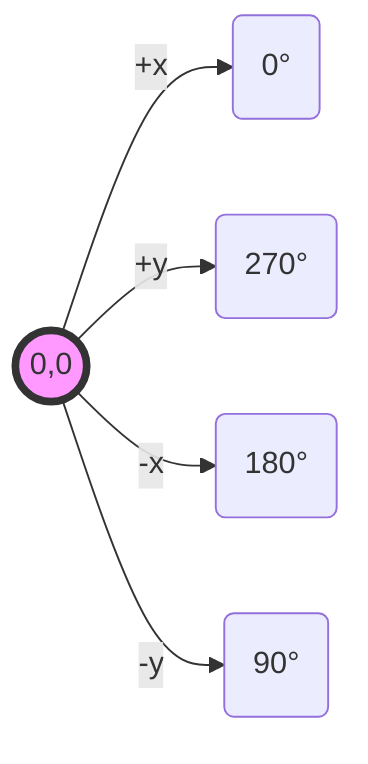
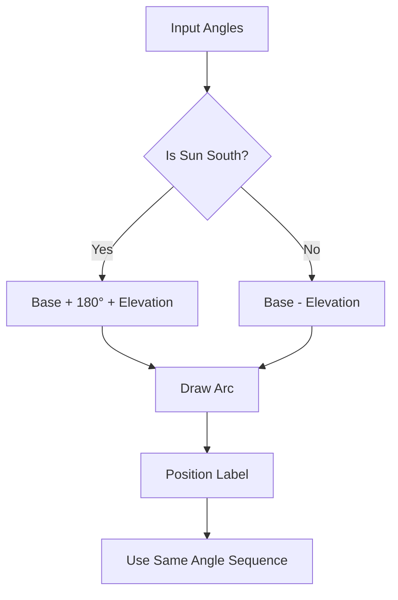
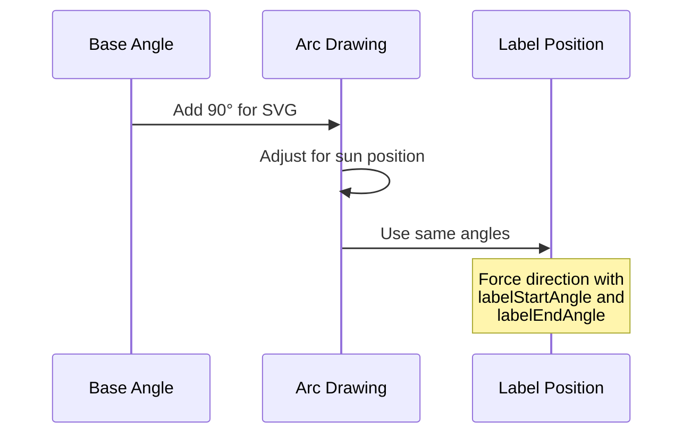

# SVG Arc Drawing Guide for Solar Diagrams

## SVG Coordinate System


## Arc Angle Calculations


## Label Positioning Rules


## Key Points

### 1. SVG Coordinate System
- 0° starts at 3 o'clock
- Angles increase clockwise
- Y-axis increases downward
- Need 90° adjustment from geographic angles

### 2. Arc Drawing
For Southern Position (latitude > declination):
```javascript
arcBaseAngle = tangentBaseAngle + 180
finalAngle = arcBaseAngle + elevation
```

For Northern Position (latitude < declination):
```javascript
arcBaseAngle = tangentBaseAngle
finalAngle = arcBaseAngle - elevation
```

### 3. Label Positioning
Always use same angle sequence as arc:
```javascript
labelStartAngle: arcBaseAngle,
labelEndAngle: finalAngle,
forceLabelDirection: true
```

### 4. Debug Parameters
```javascript
debug: true,
angleType: 'solar'  // or 'geographic'
```

## Common Issues
1. Label appearing below tangent line
   - Solution: Force label direction to match arc
2. Label on wrong end of arc
   - Solution: Use same angle sequence as arc
3. Arc drawing in wrong direction
   - Solution: Add/subtract elevation based on sun position

## Usage Example
```javascript
drawArcWithLabel({
    startX: centerX,
    startY: centerY,
    baseAngle: tangentAngle * 180 / Math.PI,
    elevationAngle: solarElevation,
    isPositionSouth: latitude > solarDeclination,
    radius: angleRadius * 2.5,
    label: '45°',
    svg: svgElement
});
```
