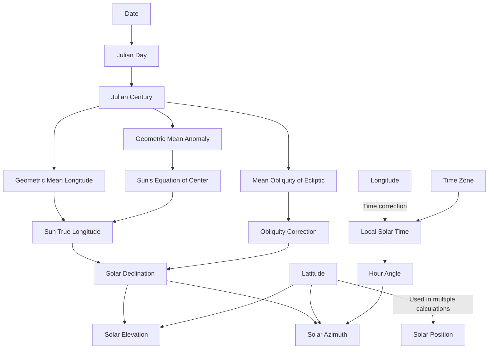

# Solar Position Calculations Documentation

This document outlines the calculations used to determine solar position parameters including declination, elevation, and azimuth angles.

## Calculation Flow



## Key Equations

### Time Calculations
- **Julian Day (JD)**:
  ```
  JD = date.getTime()/86400000 + 2440587.5 + timeZone/24
  ```
- **Julian Century (JC)**:
  ```
  JC = (JD - 2451545) / 36525
  ```

### Solar Position
- **Geometric Mean Longitude**:
  ```
  L0 = 280.46646 + JC * (36000.76983 + JC * 0.0003032) % 360
  ```
- **Geometric Mean Anomaly**:
  ```
  M = 357.52911 + JC * (35999.05029 - 0.0001537 * JC)
  ```
- **Sun's Equation of Center**:
  ```
  C = sin(M) * (1.914602 - JC * (0.004817 + 0.000014 * JC)) +
      sin(2M) * (0.019993 - 0.000101 * JC) +
      sin(3M) * 0.000289
  ```

### Obliquity and Declination
- **Mean Obliquity of Ecliptic**:
  ```
  ε0 = 23° 26' 21.448" - 46.815" * JC - 0.00059" * JC² + 0.001813" * JC³
  ```
- **Solar Declination**:
  ```
  δ = asin(sin(ε) * sin(λ))
  where:
  ε = obliquity correction
  λ = sun apparent longitude
  ```

### Final Angles
- **Solar Elevation**:
  ```
  α = 90° - |latitude - solar_declination|
  ```
- **Solar Azimuth**:
  ```
  A = atan2(sin(H), cos(H) * sin(φ) - tan(δ) * cos(φ))
  where:
  H = hour angle
  φ = latitude
  δ = solar declination
  ```

## Notes
- All trigonometric functions expect angles in radians
- Modulo operations (%) are used to keep angles in proper ranges
- Time zone corrections are applied to get accurate local solar positions
